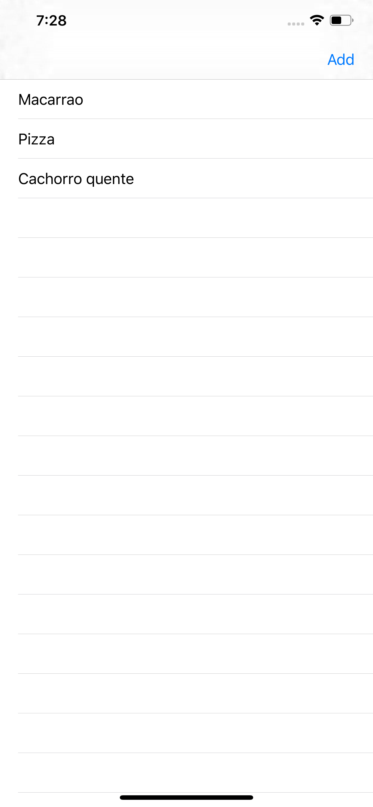
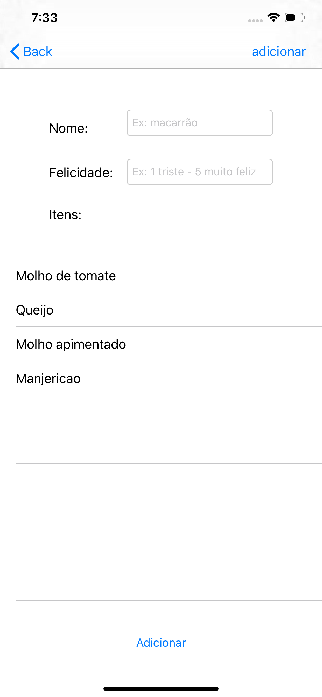
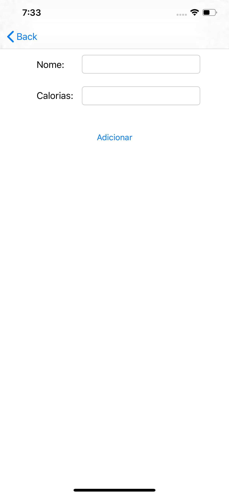
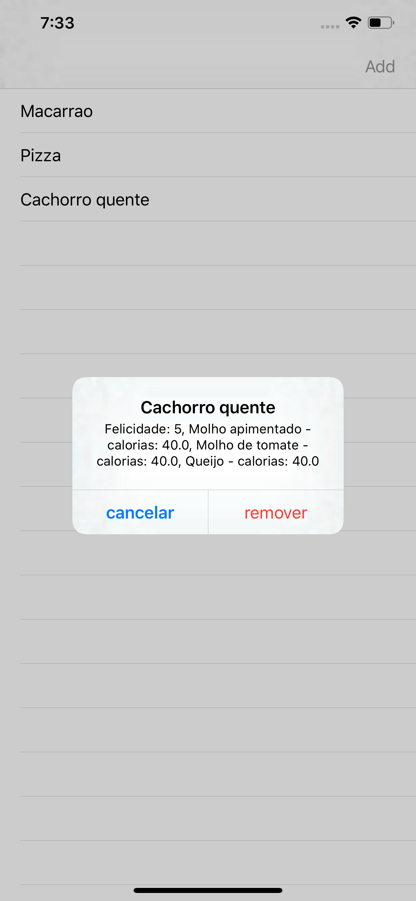

<h1 align="center">
    
</h1>

<h4 align="center">
    Eggplant Brownie
</h4>
<p align="center">
    
    
    
    
    <a href="https://www.linkedin.com/in/lineu-pastorelli-5165a7186/">
    
    </a>
      
</p>
<p align="center">
    <a href="#-projects">Project</a>&nbsp;&nbsp;&nbsp;|&nbsp;&nbsp;&nbsp;
    <a href="#-technologies">Technologies</a>&nbsp;&nbsp;&nbsp;|&nbsp;&nbsp;&nbsp
    <a href="#-layout">Layout </a>&nbsp;&nbsp;&nbsp;|&nbsp;&nbsp;&nbsp
    <a href="#-how-to-use">How to use</a>&nbsp;&nbsp;&nbsp;|&nbsp;&nbsp;&nbsp
    <a href="#-how-to-contribute">How to contribute</a>&nbsp;&nbsp;&nbsp;|&nbsp;&nbsp;&nbsp
    <a href="#-license">License</a>
</p>

<h1 align="center">
    
</h1>

## 📚 Project 

Eggplant brownie is one developed with the intention that people mark the happiness she was when eating some type of food, for example: How happyt are you when eating your favorite food? You can add to the app, you can also add companions to the food and calories that the companion has, for example: hot sauce has fifty calories.

<h1 align="center">
    
</h1>

## 🖥 Technologies

* [Swift](https://swift.org/documentation/)
* [Xcode](https://developer.apple.com/xcode/)

## 🔖 Layout 

<p align="center">
    
    
    
    
</p>

## ❓ How to use

To clone and run this application, you'll need [Git](https://git-scm.com), [Xcode](https://developer.apple.com/xcode/). This app is only executable in MacOS environment, you need to have the latest versions of Xcode installed on your machine.

Execute the command line:

### Clone the project
```bash
# Clone this repository
$ git clone https://github.com/lineuxyz/eggplant-brownie

# Opening project
$ Open in Xcode.
```

## 🤔 How to contribute

* Make a fork;
* Create a branch with your feature: `git checkout -b my-feature`;
* Commit changes: `git commit -m "feat: my new feature`;
* Make a push to your branch: `git push origin my-feature`

After merging your receipt request to done, you can delete a branch from yours.

## 📜 License

This projet is under the MIT license. See the [LICENSE](LICENSE) for details.

Made with ❤️ by [Lineu Pastorelli](https://www.linkedin.com/in/lineu-pastorelli-5165a7186/)
